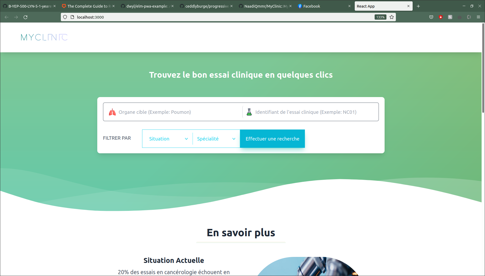
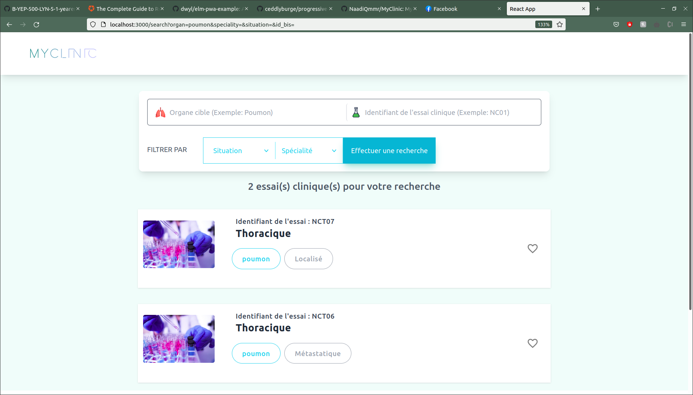

# MyClinic

Don't worry, it is only the HTML text that is in French.

*Home Page*


*Search*


## Introduction

I had to pass a technical test a few times ago to test my fullstack skills.
The company aims at put in relation cancer patients and clinical trials.
Given a csv with 5 columns (Speciliality, Organ, Id, Situation) I had to make a little search engines with filters.
The constraints were :
  * Use **SQLAlchemy**
  * using **Python** as Backend and **React** at front

I chose Flask because it is really small, you aren't annoyed by one thousand config file and it is really easy to debug. In addition, it couples well with SQLAlchemy.
And I just choose React because of my experience with it.

> Why publish it ?
Well, I had a few hard times while I was looking for tutorials (I am kind of a low level developper and my web skills aren't incredible) and I think it would be nice if people who are looking for a few things can find it in this repository.

## How to run it

TODO : Write a Dockerfile
In one terminal, run:
```bash
pip3 install -r api/requirements.txt
python3 api/models.py
python3 api.app.py
```
And in another one, run:
```bash
cd front; npm i
npm run start
```
And you should see the website running on http://localhost:3000. Enjoy!
